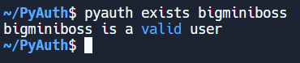
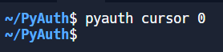
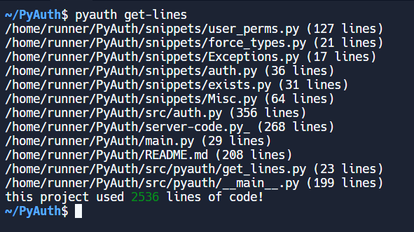

As many people have made a lot of python applications in console. However, replit's auth has one major problem: it doesn't work in console so I created this application and you can now securely use replit auth in python console.
- [x] ensures that auth-ed is a person, so this eliminates quite a few problems with people creating fake, non-replit accounts on console apps
- [x] ensures that the person attempting to auth is the person who has authed (no impersonatation)
- [x] thus, you ensure you can only auth as yourself and with banning, you ensure a non-toxic eco-system
- [x] it even includes a command line!

You can fork and make your own server [here](https://replit.com/@bigminiboss/PyAuth-Server-forkable) to integrate into your HTTPS client (uses replit db, replit auth, and replit hosting to create a secure console application auth system and uses replit's linux virtual machine for cursor operation).

Allows you to force types in python as well as add/delete admins, (un)ban, and auth users.

Wow! this project has come so far from the side project to add replit auth to console to a full fledged 2400+ (including markdown & server code) lines project!

It's truly a labor of love from the built in replit-py styled command line to the meticulously labeled docstrings to the superbly crafted and ease-of-use functions!

The project is a replit auth solution for console with the server being housed at [PyAuth Server](https://PyAuth-Server.bigminiboss.repl.co) and the [forkable version here](https://replit.com/@bigminiboss/PyAuth-Server-forkable)

It uses uses replit db, replit auth, and replit hosting to create a secure console application auth system and uses replit's linux virtual machine for cursor operation.

If I achieve a high enough position, I will likely be able to confer with replit to increase user experience on the homepage of this repl!

# Everything is stored in auth.py but snippets can be take from the snippets folder

#### you can also fork the [pyauth server](https://replit.com/@bigminiboss/PyAuth-Server-forkable?v=1) and use that as your flask server

### auth user

```py

import auth
import os

# auths and then calls function specified function under decorater
# auth: bool = True (default): will auth
# url: str = "https://PyAuth-Server.bigminiboss.repl.co" (default)
# user: str = os.environ["REPL_OWNER"] (default)
@auth.wrapper(auth = True,
              url = "https://PyAuth-Server.bigminiboss.repl.co",
              user = os.environ["REPL_OWNER"])
def main():
    # auth.token is deleted when you use the wrapper for safety.
    print("Your token is", auth.token)

```


### ban user
```py
import auth

@auth.wrapper() # auth yourself
def main():
    auth.ban('some-sus-user')
```

### unban user

```py

import auth

@auth.wrapper() # auth yourself
def main():
    auth.unban('some-sus-user-you-thought-was-sus-but-is-actually-ok')

```

### add admin

```py

import auth

@auth.wrapper() # auth yourself
def main():
    auth.add_admin('some-admin')

```

### delete admin

```py

import auth

@auth.wrapper() # auth yourself
def main():
    auth.delete_admin('some-admin-who-does-not-deserve-to-be-admin')

```

# Other Actions

### Misc.cursor

hide/show/other cursor operations
--------------------------
* 0: hide
* 1: show

----------------------------

taken from [here](https://invisible-island.net/xterm/ctlseqs/ctlseqs.html#h4-Functions-using-CSI-_-ordered-by-the-final-character-lparen-s-rparen:CSI-Ps-SP-q.1D81)

found from [here](https://superuser.com/questions/361335/how-to-change-the-terminal-cursor-from-box-to-line)

* 2: blinking block
* 3: default
* 4: block w/ no blink
* 5: blinking underline
* 6: underline w/ no blink
* 7: blinking bar
* 8: bar w/ no blink

```py
from snippets.Misc import cursor

cursor() # can be 0-8

```

### force_type

```py

from snippets.force_types import force_type

force_type("hello world", str)
force_type("hello world", str, lambda x: x == "hello world")
force_type("hello world", int) # exception raised

```

# Using Cli

```bash

pyauth [OPTION] COMMAND [ARGS]

```

### exists

```bash

pyauth exists bigminiboss

```



### ban

```bash

pyauth ban USER

```

### unban

```bash

pyauth unban USER

```

### add

```bash

pyauth add USER

```

### delete

```bash

pyauth delete USER

```

### cursor

```bash

pyauth cursor NUM

```


### see how many lines it took to create this project

```bash

pyauth get-lines

```


#### quiet

```bash

pyauth get-lines -q

```